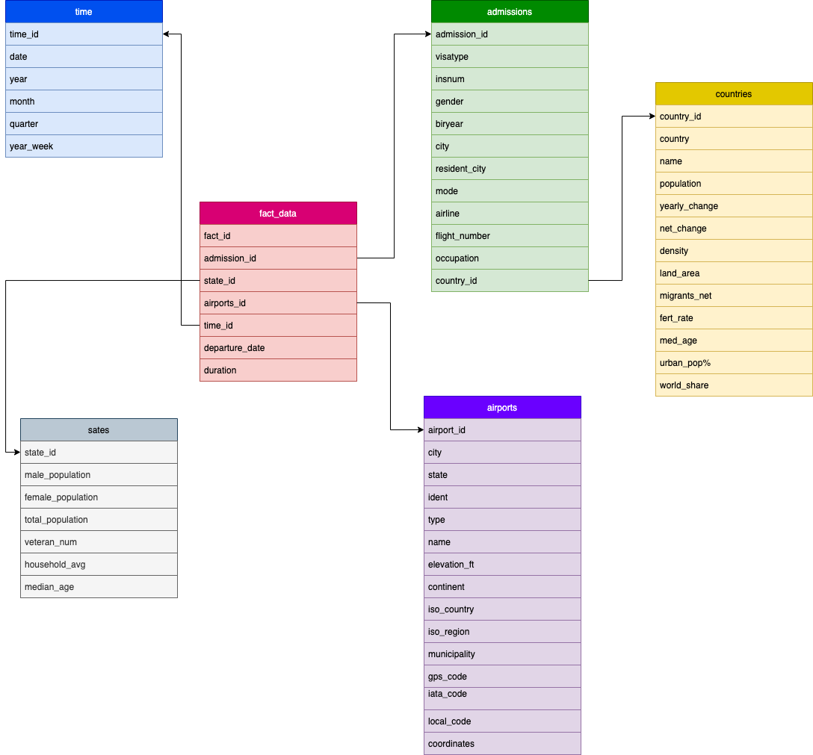
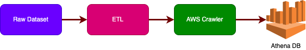
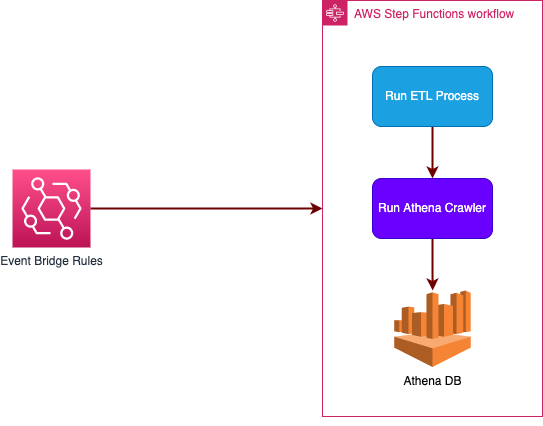

# The US IMMIGRATIONS INSIGHT APP
In this application we want to identify travels to the US by immagrations from accross the world. In out app, we are using following datasets:

- I94 Immigration Data: This data comes from the US National Tourism and Trade Office. For more information click [here](https://travel.trade.gov/research/reports/i94/historical/2016.html).

- U.S. City Demographic Data: This data comes from OpenSoft. For more information click [here](https://public.opendatasoft.com/explore/dataset/us-cities-demographics/export/)

- Airport Code Table: This is a simple table of airport codes and corresponding cities. For more information click [here](https://datahub.io/core/airport-codes#data)

- Population By Country Data: This data comes from Kaggle. For more information click [here](https://www.kaggle.com/code/joshuaswords/awesome-eda-2021-happiness-population/data?select=population_by_country_2020.csv)

# Project Goal
The goal of this project is have a datalake for our immigrations insight app. In this datalake we should be able to easily query the datalake and it should be scaled up easily. These are sample queries that we need to find answer for that:
- Find the number of travels for each specific immagrant.
- Find the total number of days each immagrant stayed in the US.
- Find the number of travels which originated from different type of airports(small, medium, and large airports).
- Which U.S. cities, have the most number of travels.
- What is the country of a specific immagratns.
- Find number of travels based on immagrant country populations.
- Finde number of travels based on population of U.S. states.

# Project Data Model

As it's illustrated in the above diagram, we have picked a simple "SnowFlake" data-model for our dataset.

# Project Architecture

After running ETL pipeline, we want to have a Athena DB for our transformed version of our files. For this, we just need to create and run a crawler from root of our transformed files.

# Dataset Exploration:

## Immigration Dataset:
This dataset contains all data about immigrant travels into the US. There is static file in this project named `I94_SAS_Labels_Descriptions.SAS`. We use the static file with this dataset to create countries and states tables. Time and admissions table also drrived from this dataset.

## Airports Dataset:
We can map 'port' column in fact_data file with static filed helper to use create airports table

## Countries Dataset:
We can map 'res' column in fact_data file with static filed helper to use create countries table

# Files & Folder Structure

etl.py: All ETL process are handled in this module.

dwh.cfg: Configuration file for accessing resources and S3 input and ouput locations.

# Running Project
## Setup
Requirements:
- Python 3
- Pyspark
- pip
## Run
You can run this project in local with just running etl.py file.
When you want to run this project in AWS, you should change the configuration locations in dwh.cfg file to S3 support format.

# Project write-up

## Tools
In this project we have used Python and Spark for our programming. Using Spark makes us be able to scale up our project without any major problems in the future.

## How often ETL script should be run:
This ETL needs to be run in each month.
We can use the following diagram for automate this process:

## Automation

AWS Event Bridge Rule triggers AWS Step Function on every month and passes the date as input to it. Step Function first runs ETL process and then run a Crawler to create the Athena DB.

## Scenarios:
- If the data was increased by 100x:
    Because we are using AWS S3 as our storage, and also we have partioned the fact_data table based on year and month, The applicarion would be able to work without problem.
- If the pipelines were run on a daily basis by 7am:
    We just need to set-up a cron-job to trigger our spark job every day at 7am.
        
